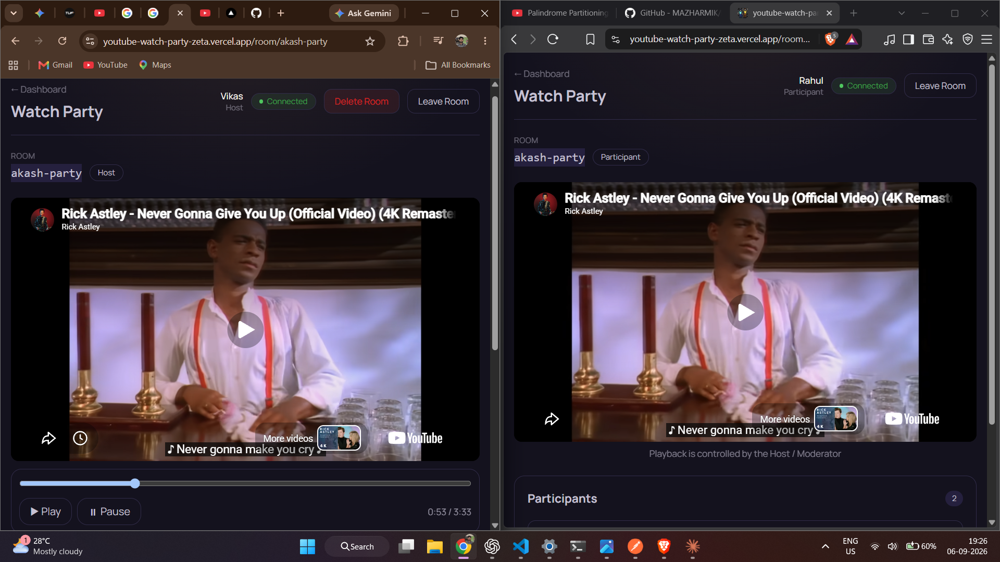

# YouTube Watch Party 🎉

A real-time YouTube Watch Party application where multiple users can watch videos together in synchronized rooms. Playback actions such as play, pause, seek, and video changes are synchronized in real time using Socket.IO.

## Live Demo

- **Frontend:** https://youtube-watch-party-zeta.vercel.app/
- **Backend:** https://youtube-watch-party-9pfb.onrender.com/

## Features

- Create and join watch party rooms using unique room codes
- Real-time YouTube playback synchronization
- Play/pause, seek, and video-change synchronization
- Host, Moderator, and Participant roles
- Host can assign roles, remove participants, and transfer host
- Backend-enforced role-based permissions
- JWT authentication with protected routes
- PostgreSQL persistence using Neon
- Online/offline participant status
- Responsive React UI

## Tech Stack

**Frontend**
- React
- Vite
- React Router
- Tailwind CSS
- Socket.IO Client
- YouTube IFrame API

**Backend**
- Node.js
- Express
- Socket.IO
- JWT
- bcryptjs
- PostgreSQL (`pg`)

**Deployment**
- Frontend: Vercel
- Backend: Render
- Database: Neon PostgreSQL

## Architecture

```text
                 ┌──────────────────┐
                 │   React + Vite   │
                 │    Frontend      │
                 └────────┬─────────┘
                          │
                    REST / Socket.IO
                          │
                 ┌────────▼─────────┐
                 │ Node + Express   │
                 │   + Socket.IO    │
                 │ Room & Role Logic│
                 └────────┬─────────┘
                          │
                     PostgreSQL
                          │
                 ┌────────▼─────────┐
                 │  Neon Database   │
                 │ Users / Rooms /  │
                 │ Participants /   │
                 │ Playback State   │
                 └──────────────────┘
```

## Real-Time Synchronization

The client emits playback events through Socket.IO. The backend authenticates the socket, validates the user's role, updates the room state, and broadcasts the change to other participants.

New participants receive the current playState, currentTime, and videoId when joining a room.

## Screenshots

### Synchronized Watch Party

Host and participant views showing the same YouTube video and synchronized playback.



### Participant View

Participants can watch the synchronized video while playback controls remain restricted to the Host/Moderator.


## Role-Based Access

| Role | Permissions |
|------|-------------|
| Host | Full playback control, assign roles, remove participants, transfer host |
| Moderator | Play/pause, seek, change video |
| Participant | Watch only |

Permissions are enforced on the backend, so restricted users cannot bypass the frontend and perform unauthorized playback actions.

## Project Structure

```text
youtube-watch-party/
├── client/              # React + Vite frontend
│   └── src/
│
├── server/              # Node + Express backend
│   └── src/
│       ├── db/
│       ├── routes/
│       ├── services/
│       └── socket/
│
└── README.md
```

## Local Setup

### 1. Clone the repository

```bash
git clone https://github.com/vikasxvrma/youtube-watch-party
cd youtube-watch-party
```

### 2. Backend

```bash
cd server
npm install
```

Create `server/.env`:

```env
DATABASE_URL=your_neon_database_url
JWT_SECRET=your_jwt_secret
CLIENT_URL=http://localhost:5173
PORT=5000
```

Run:

```bash
npm run dev
```

Backend: `http://localhost:5000`

### 3. Frontend

Open another terminal:

```bash
cd client
npm install
```

Create `client/.env`:

```env
VITE_API_URL=http://localhost:5000
```

Run:

```bash
npm run dev
```

Frontend: `http://localhost:5173`

## Production Deployment

The frontend is deployed on Vercel and the Node.js/Socket.IO backend is deployed on Render.

Production communication:

```text
Vercel Frontend
       │
       │ HTTPS / Socket.IO
       ▼
Render Backend
       │
       ▼
Neon PostgreSQL
```

Environment variables are configured on the respective deployment platforms and are not committed to the repository.

**Note:** The Render free service may spin down after inactivity, so the first request after a period of inactivity can take longer.

## Key WebSocket Events

- `join_room`
- `leave_room`
- `play`
- `pause`
- `seek`
- `change_video`
- `assign_role`
- `remove_participant`
- `user_joined`
- `user_left`
- `role_assigned`
- `participant_removed`
- `sync_state`

## Future Improvements

- Redis adapter for horizontal Socket.IO scaling
- Persistent room chat
- Reactions
- Automated tests
- Additional security and rate limiting

## Author

**Vikas Verma**
GitHub: [@vikasxvrma](https://github.com/vikasxvrma)
